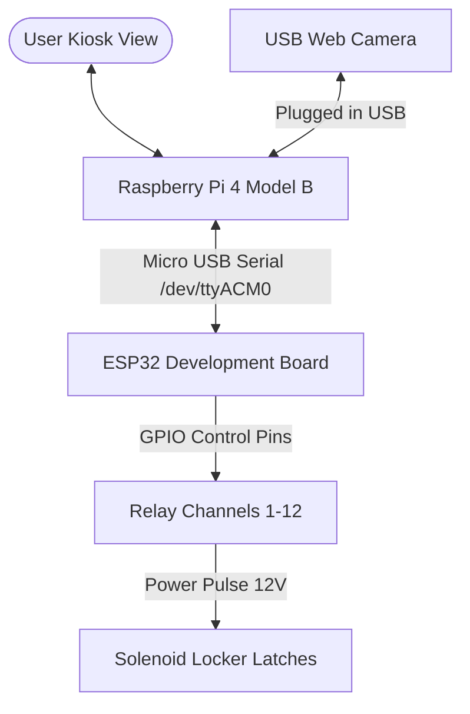

# 🍓 Raspberry Pi 4 & ESP32 Deployment Guide

This guide explains how to deploy the **SIMATS Smart Locker** software on your Raspberry Pi 4 Model B, flash the ESP32 controller, connect them via USB Serial, and configure **Chromium Kiosk Mode** so the app boots full-screen automatically on startup.

---

## ⏱️ Chronological Deployment Workflow

For the easiest setup experience, follow these steps in order:
1. **[Step 1] Flash the ESP32:** Flash the ESP32 firmware using your main development laptop *before* connecting it to the Raspberry Pi or placing it inside the physical kiosk cabinet enclosure.
2. **[Step 2] Install Raspberry Pi OS:** Write the OS image to the SD card, plug it into the Pi, and run the first-boot setup.
3. **[Step 3] Set Up Software on Pi:** Clone this repository on the Pi, install Python / Node dependencies, and run a test start.
4. **[Step 4] Wire Hardware:** Connect the ESP32 to the Pi via USB, wire the ESP32 output pins to the relay board, and hook up the solenoids.
5. **[Step 5] Configure Kiosk Autostart:** Set up the systemd/LXDE script to launch on boot automatically.

---

## 🔌 Hardware Architecture & Connections



1. **USB Web Camera:** Plug into any USB 3.0 (blue) port on the Raspberry Pi 4.
2. **ESP32 Controller:** Connect the ESP32 micro-USB port to a Raspberry Pi USB port using a data-capable USB cable.
3. **Relay Board:** Connect the ESP32 GPIO output pins to the input pins of your 5V/12V multi-channel relay module.
4. **Locker Locks:** Connect the NC (Normally Closed) or NO (Normally Open) relay terminal loop to your 12V power supply and lock solenoids.

---

## 🧠 Architectural Design: Dynamic Flashing vs. Dynamic Mapping

You requested an analysis of whether we can compile and flash the ESP32 on-the-fly during the Kiosk's setup page. Here are the two approaches to handle dynamic locker layouts:

### Approach A: Dynamic Serial Mapping (Recommended & Implemented)
Instead of compilation & flashing on-the-fly (which is slow and error-prone), we flash **one generic, smart firmware** to the ESP32.
- The ESP32 is flashed once with a static pin mapping (e.g. Pin 1 = Locker 1, Pin 2 = Locker 2).
- During the Setup page on the kiosk, the Admin specifies the number of lockers (e.g. 10 lockers) and maps them to controllers.
- The SQLite database on the Raspberry Pi stores this layout mapping.
- When Locker "A-05" is triggered, the Pi backend reads the DB configuration, translates it to pin index `5` on controller `1`, and simply sends `UNLOCK 5` to the ESP32.
- **Why this is better:** If the locker setup changes (e.g. you add more lockers or change names), you simply modify the setup page. **No ESP32 reflashing is required.** The microcontroller code remains unchanged, robust, and stable.

### Approach B: Dynamic ESP32 Flashing via Pi (Advanced & Optional)
If you want the Raspberry Pi to compile and flash the ESP32 directly:
- **How it works:** We install `arduino-cli` and `esptool` on the Raspberry Pi. When the admin edits the setup page, the FastAPI backend writes a custom C++ header file (`config.h` containing pin and locker array variables), triggers shell compilation (`arduino-cli compile`), and uploads the compiled binary to the ESP32 over serial.
- **Why it is discouraged:** It requires installing ~1.5GB of build compilers on the Pi, slows down the Pi significantly during compilation, and if the serial connection fluctuates during the write, it can brick the ESP32, requiring manual recovery.

*The firmware in Section 1 is designed to support **Approach A**, allowing you to dynamically change settings from the setup screen while keeping hardware code static.*

---

## ⚡ 1. Flashing the ESP32 Controller

Upload this Arduino sketch to your ESP32 using the **Arduino IDE**. It listens to the Serial line at `115200` baud and pulses GPIO pins high for **1 second** to release the locker door solenoid locks when a command is received.

### 📝 Arduino Sketch (`esp32_locker_controller.ino`)

```cpp
#include <Arduino.h>

// Map locker numbers to ESP32 GPIO Pins
// Feel free to modify this array to match your wiring connectors!
const int LOCKER_PINS[] = {
  12, // Locker 1 -> GPIO 12
  13, // Locker 2 -> GPIO 13
  14, // Locker 3 -> GPIO 14
  15, // Locker 4 -> GPIO 15
  2,  // Locker 5 -> GPIO 2  (On-board LED indicator)
  4,  // Locker 6 -> GPIO 4
  16, // Locker 7 -> GPIO 16
  17, // Locker 8 -> GPIO 17
  18, // Locker 9 -> GPIO 18
  19, // Locker 10 -> GPIO 19
  21, // Locker 11 -> GPIO 21
  22  // Locker 12 -> GPIO 22
};

const int NUM_LOCKERS = sizeof(LOCKER_PINS) / sizeof(LOCKER_PINS[0]);

void setup() {
  Serial.begin(115200);
  while (!Serial) {
    ; // Wait for serial port to connect
  }
  
  Serial.println("ESP32: Smart Locker Controller Online");

  // Initialize lock pins as output and set them LOW (relays off)
  for (int i = 0; i < NUM_LOCKERS; i++) {
    pinMode(LOCKER_PINS[i], OUTPUT);
    digitalWrite(LOCKER_PINS[i], LOW);
    Serial.printf("Initialized Locker %d on GPIO %d\n", i + 1, LOCKER_PINS[i]);
  }
}

void loop() {
  if (Serial.available() > 0) {
    String input = Serial.readStringUntil('\n');
    input.trim();
    
    // Command format: UNLOCK <number>
    if (input.startsWith("UNLOCK")) {
      int spaceIdx = input.indexOf(' ');
      if (spaceIdx > 0) {
        String numStr = input.substring(spaceIdx + 1);
        int lockerNum = numStr.toInt();
        
        if (lockerNum >= 1 && lockerNum <= NUM_LOCKERS) {
          int pinIdx = lockerNum - 1; // 0-indexed pin mapping
          int gpioPin = LOCKER_PINS[pinIdx];
          
          Serial.printf("OK UNLOCKING LOCKER %d (GPIO %d)\n", lockerNum, gpioPin);
          
          // Trigger solenoid: Turn Relay ON, wait 1 second, Turn OFF
          digitalWrite(gpioPin, HIGH);
          delay(1000); // 1-second pulse to release latch
          digitalWrite(gpioPin, LOW);
          
          Serial.printf("OK UNLOCKED %d\n", lockerNum);
        } else {
          Serial.println("ERROR: Invalid locker number");
        }
      }
    } 
    // Command format: PING
    else if (input == "PING") {
      Serial.println("PONG");
    }
  }
}
```

---

---

## 🛠️ 2. Fleet Installation via Docker Compose (Recommended)

Using **Docker Containerization** allows you to deploy on multiple Raspberry Pis without manually compiling Python packages or managing differing versions of Node/NPM/Python on each machine. All libraries, including Nginx web services, database engines, OpenCV dependencies, and Python compilers, are isolated and locked inside the container images.

### Installation Steps on a New Raspberry Pi:
1. Burn **Raspberry Pi OS (with Desktop)** onto the SD card and boot the Pi.
2. Open a terminal and clone the repository:
   ```bash
   git clone <YOUR_GIT_REPOSITORY_URL> smart-lockers
   cd smart-lockers
   ```
3. Run the one-click installer script:
   ```bash
   sudo ./install_kiosk.sh
   ```
4. **Reboot the system** to apply autostart desktop overrides:
   ```bash
   sudo reboot
   ```
### 🧹 How to Reset / Clear the Database

If you need to wipe all data (locker layouts, user records, and transaction logs) and force the Kiosk to run the **Setup Wizard** configuration screen again from scratch:

1. **Stop the running containers:**
   ```bash
   docker compose down
   ```
2. **Clear the database file (retains the file mount pointer):**
   ```bash
   cat /dev/null > apps/local-api/smart_lockers.db
   ```
3. **Start the containers again:**
   ```bash
   docker compose up -d
   ```
   *On startup, the FastAPI backend will automatically rebuild the empty table schemas in the SQLite file.*

---


## 📂 3. Manual Installation (Non-Docker Fallback)

If you prefer to install node packages, virtual environments, and python wheels directly on the host OS:

### A. Host Dependencies Setup:
```bash
# Update repositories
sudo apt update && sudo apt upgrade -y

# Install git, python utilities, and chromium browser
sudo apt install -y git python3-pip python3-venv python3-dev chromium-browser curl

# Install Node.js v23
curl -fsSL https://deb.nodesource.com/setup_23.x | sudo -E bash -
sudo apt install -y nodejs
```

### B. App Setup:
```bash
# Clone the repository
git clone <YOUR_GIT_REPOSITORY_URL> smart-lockers
cd smart-lockers

# 1. Setup Backend virtual environment
cd apps/local-api
python3 -m venv .venv
source .venv/bin/activate
pip3 install -r requirements.txt
cd ../..

# 2. Setup Frontend dependencies
cd apps/kiosk-ui
npm install
npm run build
cd ../..
```

---

## 🚀 4. Manual Verification / First Startup

Test that both apps boot correctly together on the Pi:

```bash
# 1. Start backend in terminal A
cd apps/local-api
source .venv/bin/activate
uvicorn app.main:app --host 0.0.0.0 --port 8000

# 2. Start frontend in terminal B
cd apps/kiosk-ui
npm run dev -- --host 0.0.0.0 --port 5173
```
- Open a browser on the Pi and navigate to: `http://localhost:5173`.
- Plug in the ESP32. The backend should log: `HARDWARE: Auto-discovered and connected to ESP32 on /dev/ttyACM0` (or `/dev/ttyUSB0`).
- Trigger a mock locker opening from the UI or Admin tab to hear your relay click!

---

## 🖥️ 5. Setting up Kiosk Mode (Full Screen Lock Mode)

To make the kiosk UI boot full-screen instantly when the Raspberry Pi turns on and prevent users from exiting the app, follow these steps:

### A. Make the startup script executable
We have created a helper script `start_kiosk.sh` in the project root. Make sure it is executable:
```bash
chmod +x start_kiosk.sh
```

### B. Configure Automatic GUI Login
1. Run Raspberry Pi configuration: `sudo raspi-config`
2. Navigate to **System Options** -> **Boot / Auto Login**.
3. Select **Desktop Autologin** (automatically boots into the GUI desktop as user `pi` or configured admin user).
4. Save and reboot.

### C. Create Systemd Service for Autostart
To run the startup script on Pi desktop startup, create a desktop entry:

```bash
mkdir -p ~/.config/autostart
nano ~/.config/autostart/smart_locker.desktop
```

Paste the following configurations into the file:
```ini
[Desktop Entry]
Type=Application
Name=Smart Locker Kiosk
Exec=/home/pi/smart-lockers/start_kiosk.sh
X-GNOME-Autostart-enabled=true
```
*(Replace `/home/pi/smart-lockers/` with your actual project location path on the Raspberry Pi).*

### D. Clean Chromium Crash Warning Flags (Crucial)
If the Pi loses power abruptly, Chromium will boot with a "Restore pages? Chromium didn't shut down correctly" popup, which blocks Kiosk clicks.
The `start_kiosk.sh` handles window sizing and Chromium parameters, but we can clean Chromium's preferences on boot. Add these lines to the top of your `start_kiosk.sh` file to wipe crash flags before starting:

```bash
# Clear Chromium crash flags
sed -i 's/"exit_type":"Crashed"/"exit_type":"Normal"/g' ~/.config/chromium/Default/Preferences
sed -i 's/"exited_cleanly":false/"exited_cleanly":true/g' ~/.config/chromium/Default/Preferences
```

---

## 💡 Local Testing & Mocking (Simulation Mode)

If you are developing or testing the frontend layout on your laptop without the physical ESP32 or relay hardware connected:
1. Open the configuration file [apps/local-api/.env](file:///apps/local-api/.env) (or create one if it does not exist).
2. Set:
   ```env
   SIMULATION_MODE=true
   ```
3. Restart the backend. The dashboard diagnostics will display `Simulation (Mock)` and locker releases will succeed automatically in software without physical serial errors.

---

## 🔍 Troubleshooting Commands

- **List active Serial ports:** `python3 -m serial.tools.list_ports`
- **Verify ESP32 connection logs:** `dmesg | grep tty`
- **View backend server logs:** `tail -f apps/local-api/backend.log`
- **Restart services manually:** `./start_kiosk.sh`
